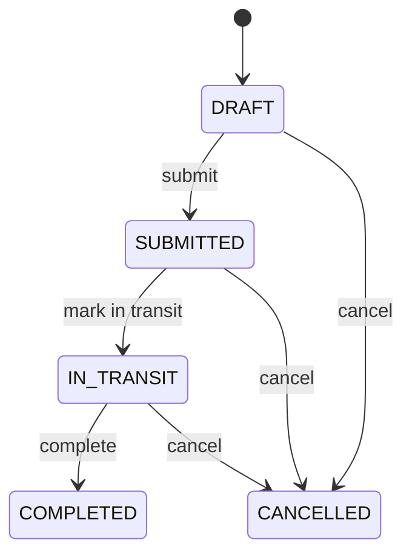
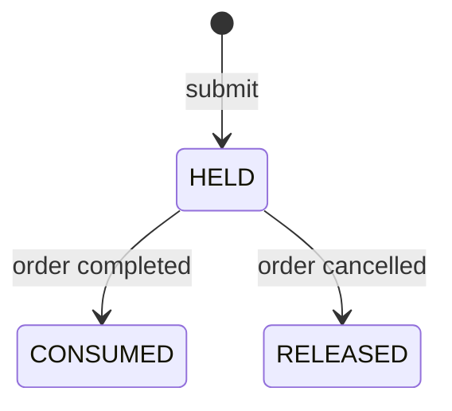

# LiqFlow

> [!IMPORTANT]
> **Project status: work in progress, not production-ready.** The core API is functional.

LiqFlow is a backend inventory-management API for tracking products and current stock levels across multiple locations. It also models transfer orders that move stock between a source and a target location through an explicit lifecycle.

## 30-second summary

| Question | Answer |
|----------|--------|
| What problem does it address? | Keeping product availability consistent when the same product is stocked in several warehouses, hubs, or stores. |
| What is the main workflow? | Create products and locations, maintain per-location inventory, create a transfer order, and move stock when the order is completed. |
| What is implemented? | REST endpoints, domain rules, PostgreSQL persistence, Flyway migrations, validation, error handling, locking, and automated tests. |
| How is it structured? | As a monolithic Spring Boot application with separate controller, service, domain, persistence, DTO, and exception layers. |

## Implemented functionality

### Business capabilities

- Create, list, update, and delete products.
- Create, list, update, and delete locations.
- Track physical, reserved, available, and low-threshold quantities for each product at each location.
- Add, deduct, reserve, and release stock.
- Find inventory by location or by product and location.
- Find inventory whose available quantity is at or below its configured minimum.
- Create transfer orders and add or remove items while an order is a draft.
- Submit, mark in transit, complete, or cancel transfer orders.
- Reserve source stock when an order is submitted, and release it again if the order is cancelled.
- Move every item in a transfer atomically when the order is completed.

### Technical highlights

- Java 21 records and constructor injection at HTTP boundaries.
- Spring MVC controllers with Jakarta Bean Validation.
- Transactional service methods for inventory and transfer operations.
- Domain entities that own inventory invariants and transfer-state rules.
- JPA optimistic locking through entity versions, plus pessimistic locks acquired in a fixed order during transfer completion.
- Flyway-managed schema changes with Hibernate schema validation.
- Database constraints for unique SKUs, location codes, transfer-order numbers, and product/location inventory pairs.
- Centralized handling of validation, domain, not-found, duplicate-data, and persistence-conflict errors.
- Mockito service tests, MockMvc web tests, and PostgreSQL integration tests.

## Architecture

LiqFlow is a monolithic Spring Boot application with a layered architecture:

```text
HTTP client
    ↓
Spring MVC controllers
    ↓
Transactional services
    ↓
Domain entities and Spring Data repositories
    ↓
PostgreSQL
```

Flyway prepares the PostgreSQL schema when the application starts.

Key code locations:

- [`controller/`](src/main/java/com/vnsnord/liqflow/controller) — REST endpoints.
- [`service/`](src/main/java/com/vnsnord/liqflow/service) — use cases, transactions, queries, and mapping; transfer completion is coordinated in [`TransferOrderService.java`](src/main/java/com/vnsnord/liqflow/service/TransferOrderService.java).
- [`domain/entity/`](src/main/java/com/vnsnord/liqflow/domain/entity) — domain behavior in [`Inventory.java`](src/main/java/com/vnsnord/liqflow/domain/entity/Inventory.java), [`TransferOrder.java`](src/main/java/com/vnsnord/liqflow/domain/entity/TransferOrder.java), and [`TransferOrderReservation.java`](src/main/java/com/vnsnord/liqflow/domain/entity/TransferOrderReservation.java).
- [`infrastructure/persistence/`](src/main/java/com/vnsnord/liqflow/infrastructure/persistence) — Spring Data repositories, locking, and queries.
- [`dto/`](src/main/java/com/vnsnord/liqflow/dto) — validated request and response contracts.
- [`exception/`](src/main/java/com/vnsnord/liqflow/exception) — typed errors and API error responses.
- [`db/migration/`](src/main/resources/db/migration) — schema creation and demo data; the initial constraints are in [`V1__init_schema.sql`](src/main/resources/db/migration/V1__init_schema.sql).

## Technology

- Java 21
- Spring Boot 4.1.1
- Spring MVC and Spring Data JPA
- PostgreSQL
- Flyway
- Jakarta Bean Validation
- JUnit, Mockito, MockMvc, and Spring integration tests
- Maven Wrapper

## Running locally

### Prerequisites

- JDK 21
- A PostgreSQL database
- Docker is optional and is only used here to start PostgreSQL

The default configuration expects PostgreSQL at `localhost:5432`, database `liqflow`, with username/password `postgres`/`postgres`. The credentials can be overridden with `DB_USERNAME` and `DB_PASSWORD`.

One way to start PostgreSQL is:

```sh
docker run --rm -d \
  --name liqflow-postgres \
  -e POSTGRES_PASSWORD=postgres \
  -e POSTGRES_DB=liqflow \
  -p 5432:5432 \
  postgres:18
```

Start the application:

```sh
./mvnw spring-boot:run
```

The API is then available under `http://localhost:8080/api/v1`.

The `dev` profile is the default. It enables SQL logging and Hikari connection-leak detection. Flyway creates the schema and loads demo data into a fresh database.

## API overview

All endpoints use the `/api/v1` prefix.

### Products

| Method | Path | Description |
|--------|------|-------------|
| `POST` | `/products` | Create a product |
| `GET` | `/products` | List products with pagination |
| `GET` | `/products/{id}` | Get a product by ID |
| `GET` | `/products/sku/{sku}` | Get a product by SKU |
| `PUT` | `/products/{id}` | Update a product; SKU is immutable |
| `DELETE` | `/products/{id}` | Delete a product when it is not referenced |

### Locations

| Method | Path | Description |
|--------|------|-------------|
| `POST` | `/locations` | Create a location |
| `GET` | `/locations` | List locations with pagination |
| `GET` | `/locations/{id}` | Get a location by ID |
| `GET` | `/locations/code/{code}` | Get a location by code |
| `PUT` | `/locations/{id}` | Update a location; code and type are immutable |
| `DELETE` | `/locations/{id}` | Delete a location when it is not referenced |

Location types are `CENTRAL_WAREHOUSE`, `REGIONAL_HUB`, and `STORE`.

### Inventory

| Method | Path | Description |
|--------|------|-------------|
| `POST` | `/inventories` | Create a product/location inventory record |
| `GET` | `/inventories` | List all inventory records |
| `GET` | `/inventories/low-stock` | List records at or below their available-stock threshold |
| `GET` | `/inventories/location/{locationId}` | List a location's inventory with pagination |
| `GET` | `/inventories/product/{productId}/location/{locationId}` | Get one product at one location |
| `GET` | `/inventories/{id}` | Get an inventory record by ID |
| `POST` | `/inventories/{id}/add-stock` | Add physical stock |
| `POST` | `/inventories/{id}/deduct-stock` | Deduct physical stock |
| `POST` | `/inventories/{id}/reserve` | Increase reserved stock |
| `POST` | `/inventories/{id}/release` | Decrease reserved stock |

Inventory supports create and read operations plus explicit stock operations. There are currently no inventory update or delete endpoints.

### Transfer orders

| Method | Path | Description |
|--------|------|-------------|
| `POST` | `/transfer-orders` | Create a draft transfer order |
| `GET` | `/transfer-orders` | List transfer orders with pagination |
| `GET` | `/transfer-orders/{id}` | Get an order and its items |
| `POST` | `/transfer-orders/{id}/items` | Add or merge an item in a draft |
| `DELETE` | `/transfer-orders/{id}/items/{itemId}` | Remove an item from a draft |
| `POST` | `/transfer-orders/{id}/submit` | Submit a non-empty draft and reserve its source stock |
| `POST` | `/transfer-orders/{id}/in-transit` | Mark a submitted order in transit |
| `POST` | `/transfer-orders/{id}/complete` | Move stock and complete the order |
| `POST` | `/transfer-orders/{id}/cancel` | Cancel an order that is not completed |

Paginated endpoints accept zero-based `page`, `size`, and `sort` query parameters. Their defaults are `page=0` and `size=20`; sorting is opt-in, for example `sort=createdAt,desc`. The global inventory and low-stock endpoints return unpaged lists.

## Example workflow

The following example assumes the application is running and that the UUIDs in requests are replaced with IDs returned by the API.

Create a product:

```sh
curl -X POST http://localhost:8080/api/v1/products \
  -H 'Content-Type: application/json' \
  -d '{
    "sku": "SKU-README-001",
    "name": "Demo widget",
    "description": "Used by the README walkthrough",
    "price": 19.90
  }'
```

Create a source and target location:

```sh
curl -X POST http://localhost:8080/api/v1/locations \
  -H 'Content-Type: application/json' \
  -d '{
    "code": "SRC-README-001",
    "name": "Source warehouse",
    "type": "CENTRAL_WAREHOUSE"
  }'

curl -X POST http://localhost:8080/api/v1/locations \
  -H 'Content-Type: application/json' \
  -d '{
    "code": "DST-README-001",
    "name": "Target store",
    "type": "STORE"
  }'
```

Create inventory at both locations before completing the transfer:

```sh
curl -X POST http://localhost:8080/api/v1/inventories \
  -H 'Content-Type: application/json' \
  -d '{
    "locationId": "<source-location-uuid>",
    "productId": "<product-uuid>",
    "initialStock": 20,
    "minThreshold": 10
  }'

curl -X POST http://localhost:8080/api/v1/inventories \
  -H 'Content-Type: application/json' \
  -d '{
    "locationId": "<target-location-uuid>",
    "productId": "<product-uuid>",
    "initialStock": 0,
    "minThreshold": 5
  }'
```

Create a draft order, add an item, and move it through its lifecycle:

```sh
curl -X POST http://localhost:8080/api/v1/transfer-orders \
  -H 'Content-Type: application/json' \
  -d '{
    "orderNumber": "ORDER-README-001",
    "sourceLocationId": "<source-location-uuid>",
    "targetLocationId": "<target-location-uuid>"
  }'

curl -X POST http://localhost:8080/api/v1/transfer-orders/<order-uuid>/items \
  -H 'Content-Type: application/json' \
  -d '{
    "productId": "<product-uuid>",
    "quantity": 15
  }'

curl -X POST http://localhost:8080/api/v1/transfer-orders/<order-uuid>/submit
curl -X POST http://localhost:8080/api/v1/transfer-orders/<order-uuid>/in-transit
curl -X POST http://localhost:8080/api/v1/transfer-orders/<order-uuid>/complete
```

After completion, the source has `5` units and the target has `15` units. Both changes commit in one database transaction.

## Domain rules and consistency

### Inventory

Each inventory record represents one product at one location and stores:

- `quantity`: physical units currently present.
- `reservedQuantity`: units marked as unavailable for another purpose.
- `availableQuantity`: `quantity - reservedQuantity`.
- `minThreshold`: the level used by the low-stock query.

The required inventory invariant is `0 <= reservedQuantity <= quantity`; non-negative stored values alone are not sufficient to guarantee `availableQuantity >= 0`. The current domain operations are written to preserve this invariant from a valid starting state, but the database does not enforce it with `CHECK` constraints.

Stock can be added, deducted, reserved, released, or consumed through explicit operations.

`deductStock` is the generic deduction. It rejects an amount greater than the physical quantity and, when the amount exceeds the currently unreserved quantity, also reduces `reservedQuantity`.

`consumeReservedStock` is the transfer-specific path. It rejects an amount greater than the reserved quantity and only ever removes units that are already reserved, so it cannot reach into stock held on behalf of another order.

### Transfer orders

A transfer follows this state machine:



- The source and target must be different locations.
- Items can only be added, merged, or removed while an order is `DRAFT`.
- Empty orders cannot be submitted.
- `DRAFT`, `SUBMITTED`, and `IN_TRANSIT` orders can transition to the terminal `CANCELLED` state.
- `COMPLETED` and `CANCELLED` orders cannot transition again.
- Completing an order changes all source and target inventory rows in one transaction.
- Inventory rows touched by a transfer are locked pessimistically, always in the same location-then-product order, so two transfers that share products cannot deadlock against each other. Any remaining contention surfaces as a `409` and is safe to retry.
- Inventory and transfer entities also use optimistic versions to detect conflicting updates.

### Reservations

Submitting an order reserves the source stock it needs, so those units stop being available to any other order. Each line item gets one reservation row recording the product, source location, quantity, and status:



- Submission fails if the source location has no inventory record for an item, or has insufficient available stock.
- Completing a transfer consumes only the quantity that order reserved, and adds the same quantity to the target location. A transfer can therefore never take stock that another order is holding.
- Cancelling a transfer releases any reservation still held, returning the units to the available quantity.
- A reservation settles exactly once, and terminal reservations are kept as history.

This is why submission validates stock rather than only completion: once a unit is reserved for one order, no other transfer can take it, so concurrent orders compete for stock at the moment of submission instead of racing at completion.

The reservation is not absolute, though. The generic `deductStock` operation can still reduce `reservedQuantity` when it removes more than the unreserved quantity, which will make the affected order fail at completion. A stricter design would have `deductStock` respect outstanding reservations as well; that is not implemented.

## Tests

Run the full suite with:

```sh
./mvnw test
```

The test suite uses:

- Mockito unit tests for service behavior.
- MockMvc tests for controller routing, validation, serialization, and status codes.
- Focused tests for centralized exception handling.
- [`@SpringBootTest` integration tests](src/test/java/com/vnsnord/liqflow/integration) backed by the configured PostgreSQL database. Each service call commits on its own, so the tests exercise real transaction boundaries rather than a single rolled-back fixture.
- Integration coverage for the reservation rules: two orders competing for the same stock, cancellation returning a hold to available quantity, and an order completing without consuming another order's reservation.

The full suite requires the PostgreSQL instance described in [Running locally](#running-locally).

## License

This repository is licensed under the [GNU Affero General Public License v3.0](LICENSE).
