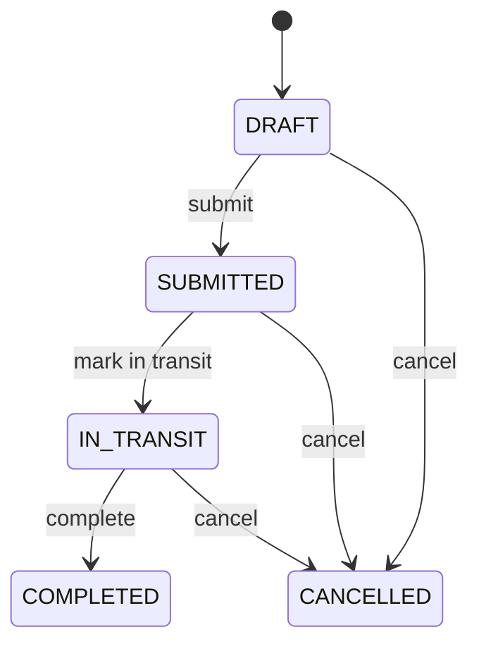

# LiqFlow

> [!IMPORTANT]
> **Project status: work in progress, not production-ready.** The core API is functional; remaining gaps are consolidated in [Known limitations](#known-limitations).

LiqFlow is a backend inventory-management API for tracking products and current stock levels across multiple locations. It also models transfer orders that move stock between a source and a target location through an explicit lifecycle.

## 30-second summary

| Question | Answer |
|----------|--------|
| What problem does it address? | Keeping product availability consistent when the same product is stocked in several warehouses, hubs, or stores. |
| What is the main workflow? | Create products and locations, maintain per-location inventory, create a transfer order, and move stock when the order is completed. |
| What is implemented? | REST endpoints, domain rules, PostgreSQL persistence, Flyway migrations, validation, error handling, locking, and automated tests. |
| How is it structured? | As a monolithic Spring Boot application with separate controller, service, domain, persistence, DTO, and exception layers. |

## Implemented functionality

### Business capabilities

- Create, list, update, and delete products.
- Create, list, update, and delete locations.
- Track physical, reserved, available, and low-threshold quantities for each product at each location.
- Add, deduct, reserve, and release stock.
- Find inventory by location or by product and location.
- Find inventory whose available quantity is at or below its configured minimum.
- Create transfer orders and add or remove items while an order is a draft.
- Submit, mark in transit, complete, or cancel transfer orders.
- Move every item in a transfer atomically when the order is completed.

### Technical highlights

- Java 21 records and constructor injection at HTTP boundaries.
- Spring MVC controllers with Jakarta Bean Validation.
- Transactional service methods for inventory and transfer operations.
- Domain entities that own inventory invariants and transfer-state rules.
- JPA optimistic locking through entity versions and pessimistic locks during transfer completion.
- Flyway-managed schema changes with Hibernate schema validation.
- Database constraints for unique SKUs, location codes, transfer-order numbers, and product/location inventory pairs.
- Centralized handling of validation, domain, not-found, duplicate-data, and persistence-conflict errors.
- Mockito service tests, MockMvc web tests, and PostgreSQL integration tests.

## Architecture

LiqFlow is a monolithic Spring Boot application with a layered architecture:

```text
HTTP client
    ↓
Spring MVC controllers
    ↓
Transactional services
    ↓
Domain entities and Spring Data repositories
    ↓
PostgreSQL
```

Flyway prepares the PostgreSQL schema when the application starts.

Key code locations:

- [`controller/`](src/main/java/com/vnsnord/liqflow/controller) — REST endpoints.
- [`service/`](src/main/java/com/vnsnord/liqflow/service) — use cases, transactions, queries, and mapping; transfer completion is coordinated in [`TransferOrderService.java`](src/main/java/com/vnsnord/liqflow/service/TransferOrderService.java).
- [`domain/entity/`](src/main/java/com/vnsnord/liqflow/domain/entity) — domain behavior in [`Inventory.java`](src/main/java/com/vnsnord/liqflow/domain/entity/Inventory.java) and [`TransferOrder.java`](src/main/java/com/vnsnord/liqflow/domain/entity/TransferOrder.java).
- [`infrastructure/persistence/`](src/main/java/com/vnsnord/liqflow/infrastructure/persistence) — Spring Data repositories, locking, and queries.
- [`dto/`](src/main/java/com/vnsnord/liqflow/dto) — validated request and response contracts.
- [`exception/`](src/main/java/com/vnsnord/liqflow/exception) — typed errors and API error responses.
- [`db/migration/`](src/main/resources/db/migration) — schema creation and demo data; the initial constraints are in [`V1__init_schema.sql`](src/main/resources/db/migration/V1__init_schema.sql).

## Technology

- Java 21
- Spring Boot 4.1.1
- Spring MVC and Spring Data JPA
- PostgreSQL
- Flyway
- Jakarta Bean Validation
- JUnit, Mockito, MockMvc, and Spring integration tests
- Maven Wrapper

## Running locally

### Prerequisites

- JDK 21
- A PostgreSQL database
- Docker is optional and is only used here to start PostgreSQL

The default configuration expects PostgreSQL at `localhost:5432`, database `liqflow`, with username/password `postgres`/`postgres`. The credentials can be overridden with `DB_USERNAME` and `DB_PASSWORD`.

One way to start PostgreSQL is:

```sh
docker run --rm -d \
  --name liqflow-postgres \
  -e POSTGRES_PASSWORD=postgres \
  -e POSTGRES_DB=liqflow \
  -p 5432:5432 \
  postgres:18
```

Start the application:

```sh
./mvnw spring-boot:run
```

The API is then available under `http://localhost:8080/api/v1`.

The `dev` profile is the default. It enables SQL logging and Hikari connection-leak detection. Flyway creates the schema and loads demo data into a fresh database.

## API overview

All endpoints use the `/api/v1` prefix.

### Products

| Method | Path | Description |
|--------|------|-------------|
| `POST` | `/products` | Create a product |
| `GET` | `/products` | List products with pagination |
| `GET` | `/products/{id}` | Get a product by ID |
| `GET` | `/products/sku/{sku}` | Get a product by SKU |
| `PUT` | `/products/{id}` | Update a product; SKU is immutable |
| `DELETE` | `/products/{id}` | Delete a product when it is not referenced |

### Locations

| Method | Path | Description |
|--------|------|-------------|
| `POST` | `/locations` | Create a location |
| `GET` | `/locations` | List locations with pagination |
| `GET` | `/locations/{id}` | Get a location by ID |
| `GET` | `/locations/code/{code}` | Get a location by code |
| `PUT` | `/locations/{id}` | Update a location; code and type are immutable |
| `DELETE` | `/locations/{id}` | Delete a location when it is not referenced |

Location types are `CENTRAL_WAREHOUSE`, `REGIONAL_HUB`, and `STORE`.

### Inventory

| Method | Path | Description |
|--------|------|-------------|
| `POST` | `/inventories` | Create a product/location inventory record |
| `GET` | `/inventories` | List all inventory records |
| `GET` | `/inventories/low-stock` | List records at or below their available-stock threshold |
| `GET` | `/inventories/location/{locationId}` | List a location's inventory with pagination |
| `GET` | `/inventories/product/{productId}/location/{locationId}` | Get one product at one location |
| `GET` | `/inventories/{id}` | Get an inventory record by ID |
| `POST` | `/inventories/{id}/add-stock` | Add physical stock |
| `POST` | `/inventories/{id}/deduct-stock` | Deduct physical stock |
| `POST` | `/inventories/{id}/reserve` | Increase reserved stock |
| `POST` | `/inventories/{id}/release` | Decrease reserved stock |

Inventory supports create and read operations plus explicit stock operations. There are currently no inventory update or delete endpoints.

### Transfer orders

| Method | Path | Description |
|--------|------|-------------|
| `POST` | `/transfer-orders` | Create a draft transfer order |
| `GET` | `/transfer-orders` | List transfer orders with pagination |
| `GET` | `/transfer-orders/{id}` | Get an order and its items |
| `POST` | `/transfer-orders/{id}/items` | Add or merge an item in a draft |
| `DELETE` | `/transfer-orders/{id}/items/{itemId}` | Remove an item from a draft |
| `POST` | `/transfer-orders/{id}/submit` | Submit a non-empty draft |
| `POST` | `/transfer-orders/{id}/in-transit` | Mark a submitted order in transit |
| `POST` | `/transfer-orders/{id}/complete` | Move stock and complete the order |
| `POST` | `/transfer-orders/{id}/cancel` | Cancel an order that is not completed |

Paginated endpoints accept zero-based `page`, `size`, and `sort` query parameters. Their defaults are `page=0` and `size=20`; sorting is opt-in, for example `sort=createdAt,desc`. The global inventory and low-stock endpoints return unpaged lists.

## Example workflow

The following example assumes the application is running and that the UUIDs in requests are replaced with IDs returned by the API.

Create a product:

```sh
curl -X POST http://localhost:8080/api/v1/products \
  -H 'Content-Type: application/json' \
  -d '{
    "sku": "SKU-README-001",
    "name": "Demo widget",
    "description": "Used by the README walkthrough",
    "price": 19.90
  }'
```

Create a source and target location:

```sh
curl -X POST http://localhost:8080/api/v1/locations \
  -H 'Content-Type: application/json' \
  -d '{
    "code": "SRC-README-001",
    "name": "Source warehouse",
    "type": "CENTRAL_WAREHOUSE"
  }'

curl -X POST http://localhost:8080/api/v1/locations \
  -H 'Content-Type: application/json' \
  -d '{
    "code": "DST-README-001",
    "name": "Target store",
    "type": "STORE"
  }'
```

Create inventory at both locations before completing the transfer:

```sh
curl -X POST http://localhost:8080/api/v1/inventories \
  -H 'Content-Type: application/json' \
  -d '{
    "locationId": "<source-location-uuid>",
    "productId": "<product-uuid>",
    "initialStock": 20,
    "minThreshold": 10
  }'

curl -X POST http://localhost:8080/api/v1/inventories \
  -H 'Content-Type: application/json' \
  -d '{
    "locationId": "<target-location-uuid>",
    "productId": "<product-uuid>",
    "initialStock": 0,
    "minThreshold": 5
  }'
```

Create a draft order, add an item, and move it through its lifecycle:

```sh
curl -X POST http://localhost:8080/api/v1/transfer-orders \
  -H 'Content-Type: application/json' \
  -d '{
    "orderNumber": "ORDER-README-001",
    "sourceLocationId": "<source-location-uuid>",
    "targetLocationId": "<target-location-uuid>"
  }'

curl -X POST http://localhost:8080/api/v1/transfer-orders/<order-uuid>/items \
  -H 'Content-Type: application/json' \
  -d '{
    "productId": "<product-uuid>",
    "quantity": 15
  }'

curl -X POST http://localhost:8080/api/v1/transfer-orders/<order-uuid>/submit
curl -X POST http://localhost:8080/api/v1/transfer-orders/<order-uuid>/in-transit
curl -X POST http://localhost:8080/api/v1/transfer-orders/<order-uuid>/complete
```

After completion, the source has `5` units and the target has `15` units. Both changes commit in one database transaction.

## Domain rules and consistency

### Inventory

Each inventory record represents one product at one location and stores:

- `quantity`: physical units currently present.
- `reservedQuantity`: units marked as unavailable for another purpose.
- `availableQuantity`: `quantity - reservedQuantity`.
- `minThreshold`: the level used by the low-stock query.

The required inventory invariant is `0 <= reservedQuantity <= quantity`; non-negative stored values alone are not sufficient to guarantee `availableQuantity >= 0`. The current domain operations are written to preserve this invariant from a valid starting state, but the database does not enforce it with `CHECK` constraints.

Stock can be added, deducted, reserved, or released through explicit operations. `deductStock` rejects an amount greater than the physical quantity. If the amount exceeds the currently unreserved quantity, it also reduces `reservedQuantity`; the consequences of this behavior for transfers are described in [Known limitations](#known-limitations).

### Transfer orders

A transfer follows this state machine:



- The source and target must be different locations.
- Items can only be added, merged, or removed while an order is `DRAFT`.
- Empty orders cannot be submitted.
- `DRAFT`, `SUBMITTED`, and `IN_TRANSIT` orders can transition to the terminal `CANCELLED` state.
- `COMPLETED` and `CANCELLED` orders cannot transition again.
- Completing an order changes all source and target inventory rows in one transaction.
- Source and target inventory rows are locked pessimistically during completion so competing transfers update the same rows serially.
- Inventory and transfer entities also use optimistic versions to detect conflicting updates.

## Tests

Run the full suite with:

```sh
./mvnw test
```

The test suite uses:

- Mockito unit tests for service behavior.
- MockMvc tests for controller routing, validation, serialization, and status codes.
- Focused tests for centralized exception handling.
- [`@SpringBootTest` integration tests](src/test/java/com/vnsnord/liqflow/integration) backed by the configured PostgreSQL database.

The full suite requires the PostgreSQL instance described in [Running locally](#running-locally).

## Known limitations

### Inventory and transfer correctness

- **Transfer completion can consume unrelated reservations — high priority.** Reservations have no owner. [`TransferOrderService`](src/main/java/com/vnsnord/liqflow/service/TransferOrderService.java) completes a transfer by calling the generic `deductStock` operation; when the requested quantity exceeds unreserved stock, that operation reduces `reservedQuantity`. A transfer can therefore consume stock reserved for another purpose. This requires a code fix: reservations need explicit ownership, and completion must consume only the transfer's own reservation or reject the operation rather than silently reducing an unrelated reservation.
- **Transfer submission does not reserve or validate stock.** Submission currently changes only the order status, so availability is not guaranteed at completion. Reservation, submission, completion, and cancellation policies need to be defined together.
- **The database does not enforce inventory invariants.** Domain operations maintain `0 <= reservedQuantity <= quantity` from a valid starting state, but PostgreSQL has no `CHECK` constraints for non-negative values or `reservedQuantity <= quantity`.
- **Transfer target inventory must already exist.** Completion fails rather than creating a target product/location inventory record.
- **Stock changes have no historical ledger.** Add, deduct, reserve, release, and transfer operations mutate current quantities without movement IDs, actors, reasons, or before/after history.
- Historical order references can make some product and location records effectively non-deletable.

### Security, integrations, and operations

- **The API is unauthenticated.** There is no authentication, authorization, role model, audit identity, or rate limiting; all endpoints are currently open.
- **External integrations are not implemented.** The Kafka starter dependency is unused, with no producer, consumer, listener, or topic configuration. There is no AWS SDK usage or integration with AWS or another cloud provider.
- **Production delivery is not implemented.** The project has no production profile, application container image, deployment manifest, CI/CD pipeline, metrics, tracing, alerting, or OpenAPI documentation.

### Test coverage and isolation

- No test currently covers a complete HTTP request through to a real PostgreSQL database; web-layer and database integration tests are separate.
- There are no dedicated concurrency, race-condition, or deadlock tests for competing transfer operations.
- Integration tests use the configured application database and manually clean their records instead of an isolated Testcontainers database or test-specific profile.

## License

This repository is licensed under the [GNU Affero General Public License v3.0](LICENSE).
